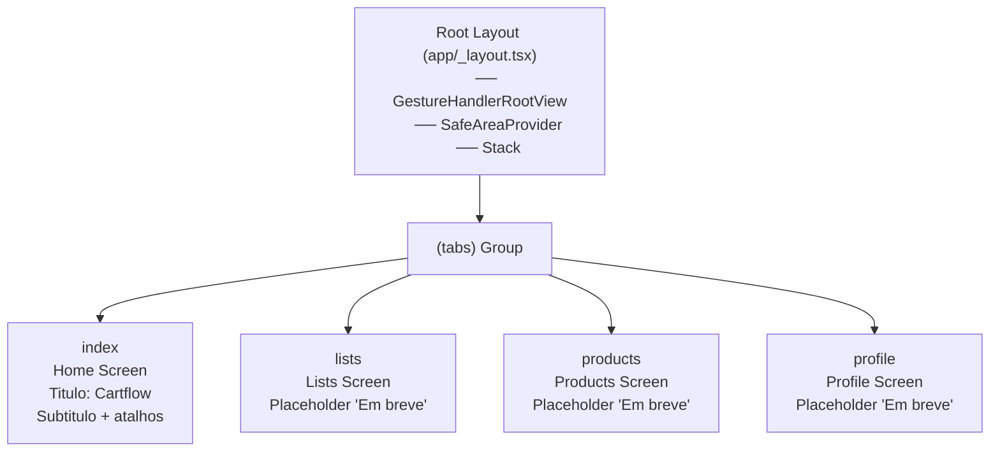

# Fase 1 — Estrutura de Navegação e Contexto — Design Document

## 1. Architecture Overview

### Navigation Tree

```
Root Layout (Stack)
└── (tabs) Group
    ├── index      → Home Screen
    ├── lists      → Lists Screen (placeholder)
    ├── products   → Products Screen (placeholder)
    └── profile    → Profile Screen (placeholder)
```

### Flow

- `app/_layout.tsx` wraps the app in `<GestureHandlerRootView>`, `<SafeAreaProvider>`, and a root `<Stack>`.
- The root `<Stack>` has one screen: `(tabs)` (the tab group).
- Inside `(tabs)`, the tab `_layout.tsx` configures a bottom tab navigator with four tabs.
- Tab switching preserves component state by default (Expo Router keeps the previous screen mounted).
- Deep linking: Each tab is addressable as `/`, `/lists`, `/products`, `/profile`.

### Mermaid Diagram



## 2. File Structure Changes

```
app/
├── _layout.tsx              ← MODIFY: add (tabs) screen to Stack
├── index.tsx                ← REMOVE (moved to app/(tabs)/index.tsx)
├── +not-found.tsx           ← not needed yet
└── (tabs)/                  ← NEW directory group
    ├── _layout.tsx          ← NEW tab bar configuration
    ├── index.tsx            ← NEW Home screen (moved from app/index.tsx)
    ├── lists.tsx            ← NEW Lists placeholder
    ├── products.tsx         ← NEW Products placeholder
    └── profile.tsx          ← NEW Profile placeholder
```

## 3. Components

### 3.1 Root Layout (`app/_layout.tsx`)

**Keep as-is** except add `<Stack.Screen name="(tabs)" />` to ensure the tab group is a named screen on the root stack.

**Changes:**
- Current `<Stack />` without named screens works via implicit routing. Add explicit screen registration for clarity.

### 3.2 Tab Layout (`app/(tabs)/_layout.tsx`)

**Responsibility:** Configure the bottom tab navigator with 4 tabs, each with:
- `title` in pt-BR (from i18n)
- `tabBarIcon` as a simple `<Text>` component with an emoji character (no icon library)
- Active tab highlighting via `tabBarActiveTintColor` from `colors.primary`

**Tech decisions:**
- Use Expo Router's `Tabs` from `expo-router` (wraps `@react-navigation/bottom-tabs`)
- `headerShown: false` on each screen — screens manage their own headers
- Safe area handled by wrapping tab content in screens using `useSafeAreaInsets`

### 3.3 Home Screen (`app/(tabs)/index.tsx`)

**Move from** `app/index.tsx`, enhance with:
- Title "Cartflow" from i18n `home.title`
- Subtitle "Sua lista de compras inteligente" from i18n `home.subtitle`
- Button "Nova Lista" from i18n `home.newCart`
- Section "Minhas Listas" from i18n `home.myCarts`
- Safe area padding via `useSafeAreaInsets`
- Use `Pressable` for the button (per react-native-expert guidelines)

### 3.4 Lists Screen (`app/(tabs)/lists.tsx`)

**Placeholder** — centered layout with:
- Title "Listas" from i18n key `tabs.lists` (to be added)
- Message "Em breve" from i18n key `tabs.comingSoon` (to be added)
- Safe area padding

### 3.5 Products Screen (`app/(tabs)/products.tsx`)

**Placeholder** — same pattern as Lists.

### 3.6 Profile Screen (`app/(tabs)/profile.tsx`)

**Placeholder** — same pattern as Lists.

## 4. Tech Decisions

| ID | Decision | Rationale |
|----|----------|-----------|
| D-01 | Use `Tabs` from `expo-router` (not `NativeTabs`) | Stable API for SDK 57. `NativeTabs` is experimental. Simple text icons work well with `Tabs`. |
| D-02 | Tab icons as emoji `<Text>` | Zero dependencies. No icon library needed until Phase 2+. |
| D-03 | `headerShown: false` on all tabs | Screens manage their own layout/header. More control over safe area and consistent look. |
| D-04 | `useSafeAreaInsets` for safe area per-screen | Simpler than wrapping everything in `SafeAreaView`. Already have `SafeAreaProvider` in root layout. |
| D-05 | Active tab color = `colors.primary` (#4A90D9) | Single source of truth from `constants/colors.ts`. |
| D-06 | i18n via `useTranslation` hook in each screen | Consistent with existing i18n setup. All user-facing strings in pt-BR. |
| D-07 | `app/index.tsx` deleted, content moved to `app/(tabs)/index.tsx` | Avoids route conflict. Expo Router treats `app/index.tsx` as `/` and `app/(tabs)/index.tsx` as `/` inside the tab group. Only one can exist. |
| D-08 | No `+not-found.tsx` for now | Out of scope. Can be added later if needed. |

## 5. i18n Keys to Add

Add to `i18n/locales/pt-BR.json`:

```json
{
  "tabs": {
    "home": "Início",
    "lists": "Listas",
    "products": "Produtos",
    "profile": "Perfil",
    "comingSoon": "Em breve"
  }
}
```

## 6. State Preservation

Expo Router's `Tabs` navigator keeps all tab screens mounted when switching. When the user navigates from Home to Lists and back, Home's scroll position and local state are preserved. This satisfies **NAV-04**.

If a future phase needs to reset state on tab focus, the `useFocusEffect` hook from `expo-router` can be used.

## 7. Risks & Concerns

| Risk | Severity | Mitigation |
|------|----------|------------|
| `app/index.tsx` must be deleted before adding `(tabs)/index.tsx` | High — Metro may crash if both exist | Delete `app/index.tsx` before creating `(tabs)/_layout.tsx` |
| `Tabs` from expo-router uses `@react-navigation/bottom-tabs` (JS-based, not native tabs) | Low — acceptable for Phase 1. Can migrate to `NativeTabs` later. | Document as tech debt in STATE.md if needed |
| No icon library means tabs look plain | Low — intentional for MVP. User can add icons in Phase 2+. | — |

## 8. Requirement Traceability

| Req ID | Satisfied By | Verification |
|--------|-------------|-------------|
| NAV-01 | `(tabs)/_layout.tsx` with 4 `Tabs.Screen` entries | Visual — 4 tabs visible on mount |
| NAV-02 | `Tabs` navigator dispatches `href` per tab | Tap each tab → correct screen renders |
| NAV-03 | `tabBarActiveTintColor` highlights active tab | Visual — active tab tinted, others gray |
| NAV-04 | `Tabs` keeps screens mounted by default | Navigate away and back → state unchanged |
| NAV-05 | Home screen renders i18n title + subtitle | Home visible on app open |
| NAV-06 | Home screen renders button + section | Visible below subtitle |
| NAV-07, 08, 09 | Placeholder screens with title + "Em breve" | Each tab shows correct title |
| NAV-E01 | `useSafeAreaInsets` on each screen | Test on device with notch/Dynamic Island |
| NAV-E02 | React Native handles rotation, tabs react to layout | Rotate → tabs remain functional |
| NAV-E03 | `(tabs)/index.tsx` is first tab (default route) | App opens on Home tab |

## 9. Implementation Order

1. Add i18n keys (`tabs.*`)
2. Create `app/(tabs)/` directory
3. Create `app/(tabs)/_layout.tsx` with 4 tabs
4. Create `app/(tabs)/index.tsx` (move content from `app/index.tsx`, enhance)
5. Create `app/(tabs)/lists.tsx` (placeholder)
6. Create `app/(tabs)/products.tsx` (placeholder)
7. Create `app/(tabs)/profile.tsx` (placeholder)
8. Update `app/_layout.tsx` to register `(tabs)` screen explicitly
9. Delete `app/index.tsx`
10. Verify: lint, typecheck, run on iOS/Android
