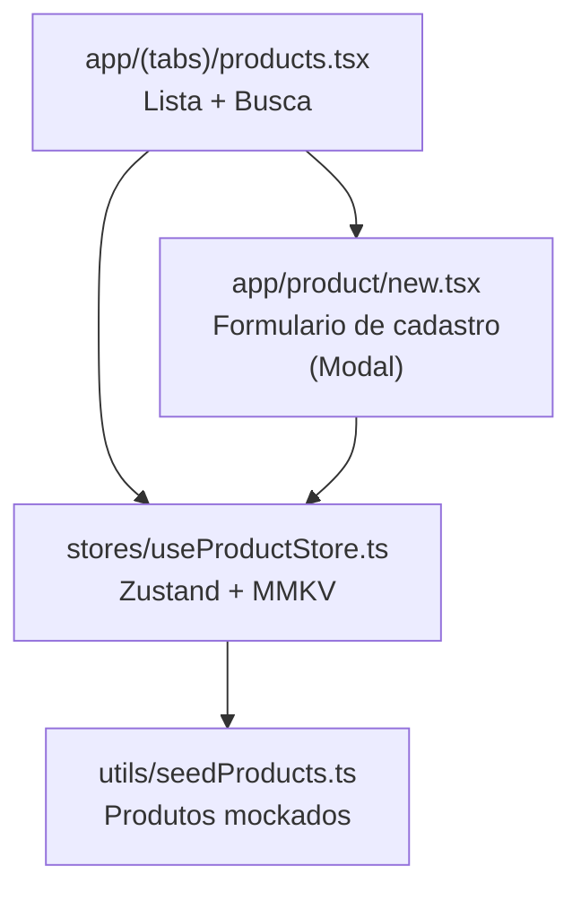

# Fase 2 — Catálogo de Produtos Design

**Spec**: `.specs/features/fase-2-catalogo/spec.md`
**Status**: Draft

---

## Architecture Overview

### Navigation Tree (atualizada)

```
Root Layout (Stack)
└── (tabs) Group
    ├── index       → Home Screen
    ├── lists       → Lists Screen (placeholder)
    ├── products    → Products Screen (lista + busca)
    └── profile     → Profile Screen (placeholder)

Modal Stack (presented from products)
    └── product/new → ProductForm Screen
```

### Fluxo de Dados

```
User Action → Screen Component → useProductStore (Zustand) → MMKV (persist)
                                     ↕
                              Seed Data (on first load)
```

### Mermaid



---

## Code Reuse Analysis

### Existing Components to Leverage

| Component | Location | How to Use |
| --------- | -------- | ---------- |
| `colors` | `constants/colors.ts` | Manter paleta existente |
| `spacing`, `fontSize`, `borderRadius` | `constants/layout.ts` | Manter tokens de layout |
| `useSafeAreaInsets` | `react-native-safe-area-context` | Padding em telas (padrão existente) |
| `useTranslation` | `react-i18next` | Strings em pt-BR |
| `Pressable` | `react-native` | Botões (padrão existente no Home) |
| MMKV storage setup | `stores/useCartStore.ts` | Replicar padrão de persistência |
| `Product` type | `types/index.ts` | Já definido, usar sem modificar |

### Integration Points

| System | Integration Method |
| ------ | ----------------- |
| ProductStore | Zustand + MMKV persist (mesmo padrão do CartStore) |
| Navegação | Expo Router — `router.push('/product/new')` para modal |
| @legendapp/list | `FlashList` ou `SectionList` agrupado por categoria |

---

## Components

### ProductStore (`stores/useProductStore.ts`)

- **Purpose**: Gerenciar CRUD de produtos com persistência MMKV
- **Location**: `stores/useProductStore.ts`
- **Interfaces**:
  - `products: Product[]` — lista de produtos
  - `addProduct(product: Omit<Product, 'id'>): void` — criar produto com ID auto-gerado
  - `searchProducts(query: string): Product[]` — filtro case-insensitive por nome
  - `initializeWithSeed(): void` — carregar seed data se store vazia
- **Dependencies**: MMKV, Zustand, `types/index.ts`, `utils/seedProducts.ts`
- **Reuses**: Padrão de persistência do `useCartStore.ts` (MMKV + createJSONStorage)

### Products Screen (`app/(tabs)/products.tsx`)

- **Purpose**: Exibir lista de produtos agrupados por categoria com busca
- **Location**: `app/(tabs)/products.tsx` (substitui placeholder)
- **Interfaces**: N/A (screen component)
- **Dependencies**: `useProductStore`, `@legendapp/list`, `react-i18next`
- **Reuses**: Mesmo padrão de layout das telas existentes (SafeArea, StyleSheet, i18n)

### ProductForm (`app/product/new.tsx`)

- **Purpose**: Formulário modal para cadastrar novo produto
- **Location**: `app/product/new.tsx`
- **Interfaces**: N/A (screen component, recebe navegação via router)
- **Dependencies**: `useProductStore`, `react-i18next`
- **Reuses**: Padrão de formulário do React Native (TextInput, Pressable)

### Seed Data (`utils/seedProducts.ts`)

- **Purpose**: Lista de produtos mockados para primeira execução
- **Location**: `utils/seedProducts.ts`
- **Interfaces**:
  - `seedProducts: Product[]` — array de produtos mockados
- **Dependencies**: `types/index.ts`
- **Reuses**: Interface Product existente

---

## Data Models

Reutilizando `Product` de `types/index.ts`:

```typescript
interface Product {
  id: string;
  name: string;
  barcode?: string;
  category?: string;
  expectedPrice?: number;
}
```

**Nenhuma modificação necessária** — o tipo já cobre todos os campos necessários.

---

## Error Handling Strategy

| Error Scenario | Handling | User Impact |
| -------------- | -------- | ----------- |
| Nome vazio/só espaços | Validação no submit, exibe erro | "Nome é obrigatório" |
| Preço negativo | Validação no submit, exibe erro | "Preço deve ser positivo" |
| Nome > 100 chars | Validação no submit, exibe erro | "Nome muito longo (máx. 100 caracteres)" |
| MMKV write failure | Try/catch na store, exibe erro | "Erro ao salvar produto" |

---

## Risks & Concerns

| Concern | Location | Impact | Mitigation |
| ------- | -------- | ------ | ---------- |
| @legendapp/list requer mock em testes | Test files | Testes quebram sem mock | Adicionar mock do `@legendapp/list` no setup dos testes |
| Store vazia + seed duplicado | `useProductStore.ts` | Seed executar múltiplas vezes | Usar flag `_seeded` na store (não persiste, apenas memória) |

---

## Tech Decisions

| Decision | Choice | Rationale |
| -------- | ------ | --------- |
| Agrupamento por categoria | SectionList-like com @legendapp/list | `LegendList` não tem SectionList nativo; usar `React.useMemo` para agrupar produtos em seções |
| Navegação para formulário | Modal (Stack Screen) | Melhor UX para formulário — não perde contexto da lista |
| ID de produto | `prod_${Date.now()}_${random}` | Simples e sem colisão para MVP — mesmo padrão do CartStore |
| Seed flag | Variável de módulo (`let _seeded = false`) | Não persiste — garante execução única por sessão |

---

## Implementation Order

1. Seed data (`utils/seedProducts.ts`)
2. ProductStore (`stores/useProductStore.ts`) + seed init
3. ProductForm (`app/product/new.tsx`)
4. Products Screen (`app/(tabs)/products.tsx`) — substituir placeholder
5. i18n keys para produtos
6. Testes unitários
