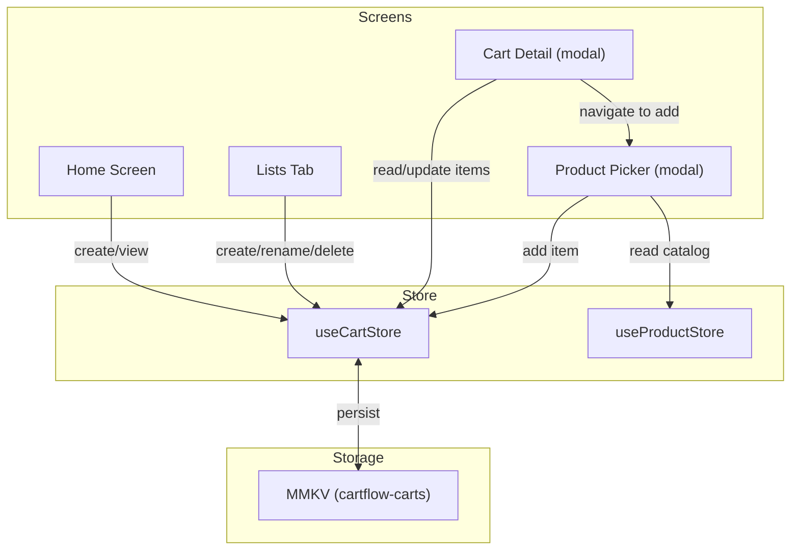

# Shopping Lists — Cart Management Design

**Spec**: `.specs/features/fase-3-listas/spec.md`
**Status**: Draft

---

## Architecture Overview

Expand the existing `useCartStore` to manage full `Cart[]` (with items), replacing the current `CartSummary[]`-only approach. Add two new modal screens (cart detail, product picker) following the existing `product-form` modal pattern. Wire the Home screen and Lists tab to the expanded store.



---

## Code Reuse Analysis

### Existing Components to Leverage

| Component | Location | How to Use |
|-----------|----------|------------|
| `useCartStore` | `stores/useCartStore.ts` | Expand with item management (addItem, removeItem, updateQuantity) |
| `useProductStore` | `stores/useProductStore.ts` | Read-only — product picker reads catalog from here |
| `Product` type | `types/index.ts` | Already defined — used for product picker display |
| `Cart`, `CartItem`, `CartSummary` types | `types/index.ts` | Already defined — CartSummary derived from Cart |
| `validateProduct` | `stores/useProductStore.ts` | Pattern reference for cart validation functions |
| `zustandMMKVStorage` | `lib/storage.ts` | Already configured — reuse for cart persistence |
| `colors` constants | `constants/colors.ts` | Theme colors for all new screens |
| `spacing`, `fontSize`, etc. | `constants/layout.ts` | Layout tokens for consistency |
| `formatPrice` / BRL formatting | `lib/format.ts` + `app/(tabs)/products.tsx` | Price display pattern from ProductsScreen |
| `product-form` modal pattern | `app/product-form.tsx` | Template for new modal screens (Stack screen, presentation, headerShown) |
| LegendList pattern | `app/(tabs)/products.tsx` | Category-grouped list rendering for product picker |
| Search input pattern | `app/(tabs)/products.tsx` | Search bar + real-time filtering for product picker |
| i18n keys | `i18n/locales/pt-BR.json` | `cart.*` keys pre-defined, add new keys as needed |

### Integration Points

| System | Integration Method |
|--------|--------------------|
| `useCartStore` | Expand interface — add `addItem`, `removeItem`, `updateQuantity`, `getCartItems` |
| `useProductStore` | Read-only in product picker — `products` array |
| Expo Router | Add 2 new Stack screens to `app/_layout.tsx` |
| MMKV | Already configured — cart persistence version bump + migration |

---

## Components

### 1. Expanded `useCartStore`

- **Purpose**: Single source of truth for all cart data — lists and their items
- **Location**: `stores/useCartStore.ts`
- **Changes**:
  - Replace `carts: CartSummary[]` with `carts: Cart[]` (full carts with items)
  - Add `addItem(cartId, productId, quantity)` — adds item or increments if exists
  - Add `removeItem(cartId, productId)` — removes item from cart
  - Add `updateQuantity(cartId, productId, quantity)` — sets quantity (removes if ≤0)
  - Add `renameCart(cartId, name)` — updates name + updatedAt
  - Derive `getCartSummaries()` selector — returns `CartSummary[]` for list screens
  - Derive `getCartItems(cartId)` selector — returns `CartItem[]` for detail screen
  - Validation: `validateCartName(name)` — required, max 50 chars
  - Validation: `validateQuantity(qty)` — positive integer, 1–999
  - Persistence: bump to version 2, migrate from v1 (convert `CartSummary[]` to `Cart[]` with empty items)

### 2. Cart Detail Screen (`app/cart-detail.tsx`)

- **Purpose**: View items in a shopping list, manage quantities, delete items
- **Location**: `app/cart-detail.tsx`
- **Interfaces**:
  - Route params: `{ cartId: string }`
  - Renders: cart name as title, item count, LegendList of items, FAB to add products
  - Each item row: product name, category, quantity stepper, swipe-to-delete
- **Dependencies**: `useCartStore`, `useProductStore` (for product names), `@legendapp/list`
- **Reuses**: LegendList pattern from ProductsScreen, BRL price formatting, swipe gesture from react-native-gesture-handler

### 3. Product Picker Screen (`app/product-picker.tsx`)

- **Purpose**: Select a product from catalog to add to a cart
- **Location**: `app/product-picker.tsx`
- **Interfaces**:
  - Route params: `{ cartId: string }`
  - Renders: search bar, LegendList of products (categorized), quantity input on selection
  - On select: shows quantity prompt (default 1), then calls `useCartStore.addItem`
- **Dependencies**: `useCartStore` (addItem), `useProductStore` (products list), `@legendapp/list`
- **Reuses**: Search + category group pattern from ProductsScreen (refactor shared logic into a hook or keep inline)

### 4. Expanded Home Screen (`app/(tabs)/index.tsx`)

- **Purpose**: Wire "Nova Lista" button and show recent lists
- **Changes**:
  - "Nova Lista" button → calls `useCartStore.addCart` with prompted name
  - "Minhas Listas" section → renders up to 5 most recent carts with name + item count
  - Tap cart → navigate to `cart-detail` with `cartId` param
- **Reuses**: Existing HomeScreen layout, useCartStore

### 5. Expanded Lists Screen (`app/(tabs)/lists.tsx`)

- **Purpose**: Full list management — create, view, rename, delete lists
- **Changes**:
  - Replace placeholder with LegendList of all carts
  - "Nova Lista" button (FAB) → create new list
  - Long-press menu → rename / delete options
  - Delete → confirmation dialog → remove cart
  - Tap → navigate to cart detail
- **Reuses**: LegendList pattern, useCartStore, i18n common keys

---

## Data Models

### Cart (expanded from existing)

```typescript
interface Cart {
  id: string;
  name: string;
  items: CartItem[];
  createdAt: string;
  updatedAt: string;
}
```

No changes to the type definition — it's already correct. The store change is internal (storing full carts instead of summaries).

### CartItem (existing)

```typescript
interface CartItem {
  productId: string;
  quantity: number;
  currentPrice?: number; // Phase 4 scope — ignored in Phase 3
}
```

No changes needed.

---

## Error Handling Strategy

| Error Scenario | Handling | User Impact |
|---------------|----------|-------------|
| Cart name empty | Validation error returned from store | Inline error below input field |
| Cart name > 50 chars | Validation error returned from store | Inline error below input field |
| Quantity < 1 | Remove item from cart | Item disappears from list |
| Quantity > 999 | Cap at 999 | Stepper/input caps at 999 |
| Product not in catalog (orphaned) | Show item but skip in calculations | Item shows "Produto removido" or similar |
| MMKV write failure | Zustand handles internally (no crash) | Data may not persist — rare |

---

## Risks & Concerns

| Concern | Location | Impact | Mitigation |
|---------|----------|--------|------------|
| Cart persistence version migration (v1 → v2) | `stores/useCartStore.ts` | Data loss if migration fails | Write migration that converts `CartSummary[]` to `Cart[]` with empty items; test migration path |
| Orphaned product references (product deleted from catalog) | `stores/useCartStore.ts` | Cart item references non-existent product | ProductsScreen checks product exists before displaying price; show fallback text for missing products |
| LegendList performance with many items | `app/cart-detail.tsx` | Jank on large lists | Use `estimatedItemSize` and stable keys; items array is per-cart so typically small (<50) |

---

## Tech Decisions

| Decision | Choice | Rationale |
|----------|--------|-----------|
| Single cart store (full Cart[]) vs separate item store | Single store | Simplicity — avoids cross-store references; cart items are tightly coupled to carts |
| Cart detail as modal vs tab screen | Modal (Stack screen) | Consistent with product-form pattern; cart detail is a focused task, not a persistent view |
| Product picker as modal vs inline | Modal | Separation of concerns — product selection is a distinct workflow |
| Quantity editing — stepper vs inline input | Inline stepper (+/- buttons) | Common mobile pattern; fast for typical shopping quantities (1–10) |
| Validation functions as exported pure functions | Yes (matches `validateCartName` pattern) | Testable independently, matches existing `validateProduct` pattern |
| MMKV version bump to 2 with migration | Yes | Required to change storage shape from CartSummary[] to Cart[] |

---

## Navigation Structure (Updated)

```
RootLayout (Stack, GestureHandlerRootView + SafeAreaProvider)
├── (tabs) -- Tab Navigator
│   ├── index     -- Home ("Inicio")
│   ├── lists     -- Lists ("Listas")
│   ├── products  -- Products ("Produtos")
│   └── profile   -- Profile ("Perfil")
├── cart-detail    -- Modal (cart detail with items)
└── product-picker -- Modal (product catalog picker)
```

---

## i18n Keys to Add

```json
{
  "cart": {
    "title": "Lista",
    "name": "Nome da lista",
    "namePlaceholder": "Ex: Compras do mês",
    "items": "itens",
    "emptyState": "Sua lista está vazia. Adicione produtos!",
    "addItem": "Adicionar produto",
    "noItems": "Nenhum item",
    "confirmDelete": "Excluir esta lista?",
    "confirmDeleteMessage": "Todos os itens serão removidos.",
    "rename": "Renomear",
    "createdAt": "Criada em"
  },
  "item": {
    "addTitle": "Adicionar à lista",
    "quantity": "Quantidade",
    "remove": "Remover",
    "confirmRemove": "Remover este item da lista?"
  },
  "lists": {
    "title": "Minhas Listas",
    "emptyState": "Nenhuma lista criada. Toque em + para começar!",
    "newList": "Nova Lista",
    "itemCount": "{{count}} itens"
  },
  "home": {
    "recentLists": "Listas Recentes"
  },
  "error": {
    "cart": {
      "name": {
        "required": "Nome da lista é obrigatório",
        "maxLength": "Nome muito longo (max. 50 caracteres)"
      },
      "quantity": {
        "positive": "Quantidade deve ser maior que zero",
        "max": "Quantidade máxima é 999"
      }
    }
  }
}
```
