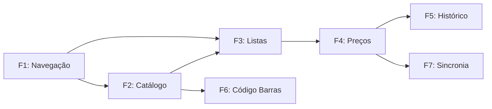

> **DEPRECATED** — This file is superseded by `.specs/roadmap.md` (managed by the Loop Orchestrator).
> Kept for reference. The authoritative roadmap is now at `.specs/roadmap.md`.

# Cartflow — MVP Roadmap (legacy)

Roadmap evolutivo para o MVP do Cartflow, organizado em fases com dependências claras. Cada fase produz uma feature completa e testável.

## Stack

| Layer | Technology |
|---|---|
| Framework | Expo SDK 52 (managed) |
| Platform | React Native 0.76 (Android + iOS) |
| Language | TypeScript 5.3 (strict) |
| Routing | Expo Router 4 (file-based) |
| State | Zustand 5 + MMKV 3 (persist middleware) |
| i18n | i18next + react-i18next + expo-localization (pt-BR) |
| Lists | @legendapp/list |
| Images | expo-image |
| Animations | react-native-reanimated 3 + worklets |
| Gestures | react-native-gesture-handler |
| Testing | Jest + @testing-library/react-native |
| Lint / Format | Biome |
| Storage | MMKV (primary key-value) |

## Fases

### Fase 1 — Estrutura de Navegação e Contexto

**Dependências:** Nenhuma (base do app)

**Objetivo:** Estabelecer a estrutura de navegação e o contexto visual do app.

| # | Tarefa | Descrição |
|---|---|---|
| 1.1 | Tab navigation | Configurar Expo Router com Bottom Tabs (Home, Listas, Produtos, Perfil) |
| 1.2 | Tela Home | Resumo com acesso rápido às principais ações |
| 1.3 | Telas placeholder | Esqueleto das telas de Listas, Produtos e Perfil |

**Critérios de aceite:**
- 4 abas navegáveis com ícones
- Cada tela exibe seu título em pt-BR
- Layout responsivo (Android + iOS)

---

### Fase 2 — Catálogo de Produtos

**Dependências:** Fase 1

**Objetivo:** Permitir que o usuário navegue, busque e cadastre produtos.

| # | Tarefa | Descrição |
|---|---|---|
| 2.1 | ProductStore | Store Zustand + MMKV para produtos (CRUD) |
| 2.2 | Lista de produtos | Tela com categorias usando @legendapp/list |
| 2.3 | Busca textual | Filtro por nome do produto |
| 2.4 | Cadastro manual | Formulário para criar novo produto (nome, categoria, preço esperado) |
| 2.5 | Produtos mockados | Seed data para teste inicial |

**Critérios de aceite:**
- Lista virtualizada com @legendapp/list
- Busca filtra em tempo real
- Produto persiste entre sessões (MMKV)
- Categoria opcional com fallto "Sem categoria"

---

### Fase 3 — Gerenciamento de Listas (Carts)

**Dependências:** Fase 1, Fase 2

**Objetivo:** Core do app — criar listas de compras e gerenciar itens.

| # | Tarefa | Descrição |
|---|---|---|
| 3.1 | Expandir CartStore | Adicionar items (productId, quantity, currentPrice) ao Cart existente |
| 3.2 | Tela Minhas Listas | CRUD de listas (criar, renomear, excluir) |
| 3.3 | Tela de detalhe da lista | Ver itens, totais, adicionar/remover produtos |
| 3.4 | Adicionar item à lista | Selecionar produto do catálogo, definir quantidade |

**Critérios de aceite:**
- Criar lista com nome
- Adicionar/remover produtos de uma lista
- Quantidade editável por item
- Listas persistem entre sessões

---

### Fase 4 — Precificação e Comparação

**Dependências:** Fase 3

**Objetivo:** Registrar preços e comparar com esperado.

| # | Tarefa | Descrição |
|---|---|---|
| 4.1 | Input de preço atual | Ao adicionar item, permitir registrar currentPrice |
| 4.2 | Expected vs Current | Exibir ambos os preços na tela da lista |
| 4.3 | Cálculo de totais | Total esperado, total atual, diferença |
| 4.4 | Indicador visual | Verde (atual ≤ esperado), vermelho (atual > esperado) |

**Critérios de aceite:**
- Preço atual editável por item na lista
- Totais calculados automaticamente
- Cores indicam se está dentro do esperado
- Diferença exibida em valor absoluto e percentual

---

### Fase 5 — Histórico de Compras (Pós-MVP)

**Dependências:** Fase 4

**Objetivo:** Rastrear preços ao longo do tempo por produto.

| # | Tarefa | Descrição |
|---|---|---|
| 5.1 | PriceHistoryStore | Store para histórico de preços por produto |
| 5.2 | Histórico no detalhe do produto | Gráfico ou lista de preços anteriores |
| 5.3 | Sugestão de preço esperado | Usar média do histórico como expectedPrice |

---

### Fase 6 — Leitura de Código de Barras (Pós-MVP)

**Dependências:** Fase 2

**Objetivo:** Adicionar produtos escaneando código de barras.

| # | Tarefa | Descrição |
|---|---|---|
| 6.1 | Integrar câmera | Usar expo-camera para escanear códigos |
| 6.2 | Busca por barcode | Vincular código a produto existente ou criar automaticamente |

---

### Fase 7 — Sincronia em Nuvem (Pós-MVP)

**Dependências:** Fase 4

**Objetivo:** Backup e sync entre dispositivos.

| # | Tarefa | Descrição |
|---|---|---|
| 7.1 | API REST/GraphQL | Definir e implementar backend |
| 7.2 | Auth | Login/registro |
| 7.3 | Sync engine | Sincronizar produtos, listas e histórico |

---

## Diagrama de Dependências

## Como usar este roadmap

Cada feature segue o fluxo **TLC Spec-Driven**:

1. **Specify** — abrir nova feature em `.specs/features/<feature>/spec.md`
2. **Design** — (se necessário) arquitetura em `design.md`
3. **Tasks** — (se necessário) breakdown em `tasks.md`
4. **Implement** — codificar com commits atômicos
5. **Validate** — verificar critérios de aceite

O orquestrador deve ler este arquivo no início de cada sessão para saber o contexto e o próximo passo.
